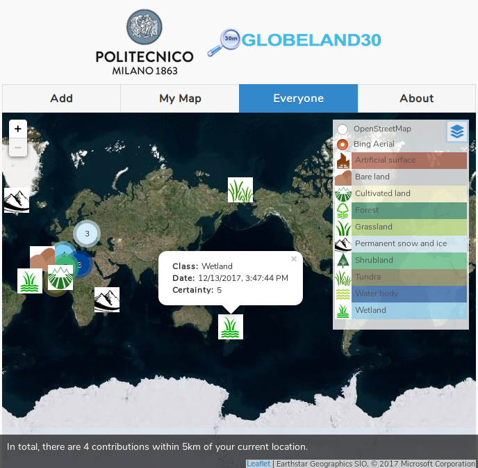

# GlobeLand30 Validation
The app "GlobeLand30 Validation" is developed to collect data on land cover classification using the 10 classes of [GlobeLand30](http://www.globallandcover.com/GLC30Download/index.aspx).

Points of interest added by everyone:

## Configuration
It mainly uses PouchDB, CouchDB, Cordova and Leaflet.

CouchDB version is 2.1.1. Installation instructions using the Apache CouchDB convenience binary packages for Unix-like systems can be found [here](http://docs.couchdb.org/en/2.1.1/install/unix.html).

Cordova version is 8.0.0. Installation instructions can be found [here](https://cordova.apache.org/docs/en/latest/guide/cli/).

The packages and platforms used in this app are already in the repository.

It may be necessary to point the app to your CouchDB instance in the "www/settings.js" file.

## Credits
The app uses [EmoMap](https://github.com/cartogroup/emomap). The developer acknowledges its contributions to the development.
